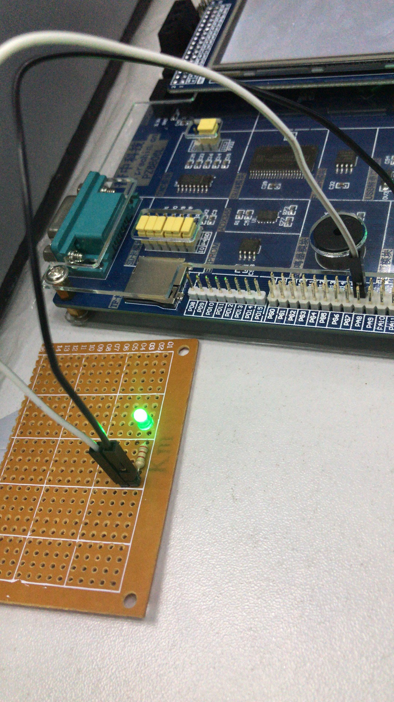

<h1 align="center" style="margin-bottom: 20px;">STM32开发版GPIO外设LED灯闪烁效果</h1>
<h2 align="center">STM32开发版pd0外设LED灯闪烁效果</h2>

<code>版本号:1.0</code>

来源: [雷小天博客](http://www.100txy.com)

## 功能

采用固体库模板实现一个外设LED灯闪烁效果

## 相关截图

## 捐献

* 参见雷小天博客[捐献作者](http://www.100txy.com)

## 来源
[雷小天个人博客](http://100txy.com)
